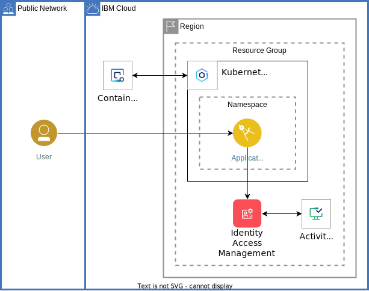

# Trusted Profiles on IBM Cloud
Some tests of Trusted Profiles with Compute Resources on IBM Cloud.

The [app.py](app.py) creates three API functions:
- `localhost:8080/`: check that the app works and return the current app version
- `localhost:8080/api/listresources` with optional query parameter **tpname**: retrieve the service account token, turn it into an IBM Cloud IAM access token, retrieve the list of resources in the cloud account
- `localhost:8080/api/listresources_crn` with optional query parameter **tpname**: the same as the previous, but just return the list of CRNs with other resource data stripped away 

# Deploy
To deploy, build the container image using the [Dockerfile](Dockerfile), then apply [app.yaml](app.yaml). Note that you need to change the container image specification in that file.

As alternative, follow the instructions in the [tutorial](https://cloud.ibm.com/docs/solution-tutorials?topic=solution-tutorials-trusted-profile-for-enterprise-security).



# Test 
Once deployed, you can log into the running container:
```
kubectl exec --namespace tptest --stdin --tty tp-demo -- /bin/bash
```

Within the container shell use **curl** to access the API:
```
curl localhost:8080
```
or:
```
curl localhost:8080/api/listresources?tpname=TPwithCR
```
or:
```
curl localhost:8080/api/listresources_crn?tpname=TPwithCR
```